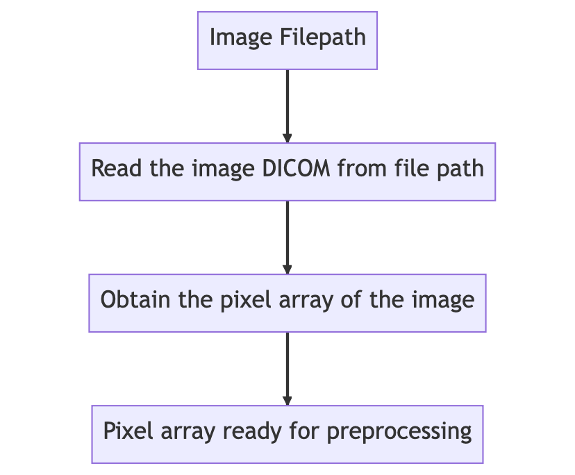
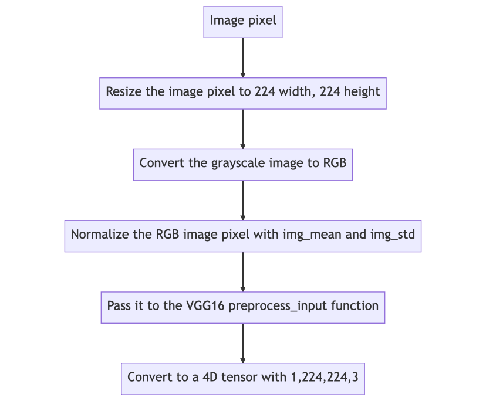
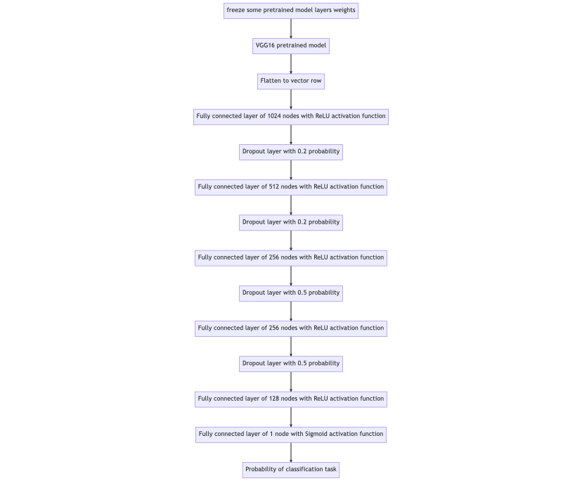
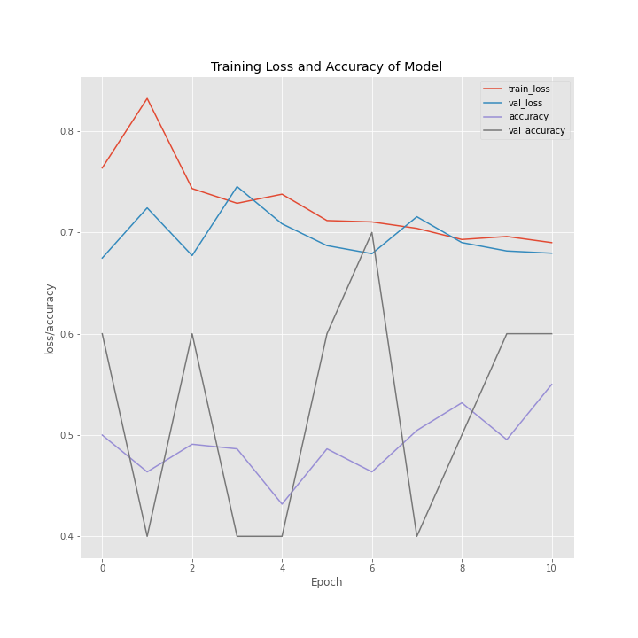
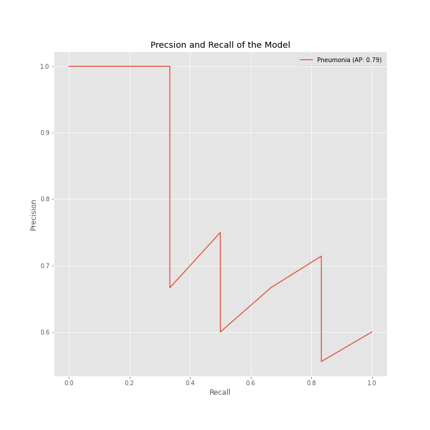

# FDA Submission

**Your Name:** AZEEZ LIADI

**Name of your Device:** PNEUTUS

## Algorithm Description

### 1. General Information

**Intended Use Statement:**
Assist radiologists to detect pneumonia from the screening of chest X-ray 2D imaging

**Indications for Use:**
The algorithm intended for use on both male and female from the ages of 1-46 who have been administered a screening of chest X-ray scan either through PA or AP view position on detection of pneumonia.

**Device Limitations:**
The device is designed to output result faster with a computer that has GPU installed. There could be a computational limitaion where there is lack of modern computer to facilitate the usuage of the algorithm.

**Clinical Impact of Performance:**
Algorithm efficient could begin to deliquench in the presence of other diseases that could impact the performance through sensitivity and specifivity, this diseases includes infiltration,atelectasis,edema and effusion.

### 2. Algorithm Design and Function

<< Insert Algorithm Flowchart >>

**DICOM Checking Steps**

**Preprocessing Steps**

**CNN Architecture**

### 3. Algorithm Training

**Parameters:**

- Types of augmentation used during training: Keras ImageDataGenerator package to rescale, flip the image horizintally,rotate at angle 20 degree,zoom out and shear the images
- Batch size: 10
- Optimizer learning rate: Adam(lr=1e-4)
- Layers of pre-existing architecture that were frozen: All layers from input layer up until block5_conv3 were frozen.
- Layers of pre-existing architecture that were fine-tuned: The last convolutional layer (block5_conv3) was left for fine tuning
- Layers added to pre-existing architecture: Flatten,fully connected layers and dropout layers.

**Final Threshold and Explanation:** The threshold is around 0.58 for both the precision and recall.The output probability of model above this threshold iimplies the detection of pneumonia and probability below the threshold is without pneumonia

### 4. Databases

**Description of Training Dataset:** This is NIH dataset of pneumonia in the wild. The training dataset makes the 80% of images with pneumonia being label and there are also other diseases in comorbidite with pneumonia. The dataset is balanced with equal number of the both classes of 2290 images.

**Description of Validation Dataset:** This makes the 20% of the whole dataset.

### 5. Ground Truth

Since pneumonia is difficult to detect by radiologists. An experienced radiologist is used to label the images and create the ground truth.

### 6. FDA Validation Plan

**Patient Population Description for FDA Validation Dataset:**
Male or female patient within the ages 1-46 scanned with xray either through AP or PA view position for detection of pneumonia

**Ground Truth Acquisition Methodology:**
Experienced radiologist label the images with pneumonia and no pneumonia i.e gold standard ground truth

**Algorithm Performance Standard:**
Algorithm threshold is around 0.58 which implies that model's probability above the threshold suggest the presence of pneumonia in the model, while below threshold doesn't detect pneumonia in the image.
